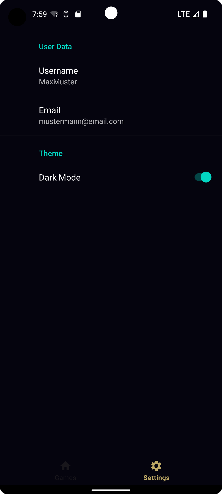

# PME Collector

Diese App wurde im Rahmen einer studentischen Leistungsfeststellung von **[Henning Venhorst](https://github.com/HenningCV)** und **[Lucas Hengelhaupt](https://github.com/Diafreak)** entwickelt.

## Installationsanweisungen
Die App wurde auf einem Google Pixel 6 mit der API Version 32 getestet, daher ist diese auch empfohlen.
Die füllt sich zudem automatisch mit Testdaten, dabei werden jedoch nur algorithmische Textinhalte generiert.

## Funktionen
Mit der App Collector ist es möglich verschiedene Spiele und in einem Spiel enthaltene Items einzutragen. Diese Inhalte können dann als bereits erspielt markieren werden, um so den Fortschritt des Spiels mitverfolgen.  
Dabei können verschiedene Filter, wie die Filterung nach noch nicht erhaltenen Items, bei der Übersicht unterstüzen. 
Jedes Item besitzt zudem noch eine Detailansicht, in der verschiedene Informationen hinterlegt werden können.  
Zusätzlich sind sowohl die Informationen eines Spiels, als auch die Informationen eines Items nachträglich änderbar.

## Zu Beachten
Es ist zu Berücksichtigen, dass das Design für den Darkmode ausgelegt ist und der Lightmode zum Proof of Concept dient.

## Screenshots

### Liste mit Spielen

### Liste der Items eines Spiels

### Item Detailansicht

### Erstellen eines Spiels

### Erstellen eines Items

### Ändern eines Elementes

### Settings

